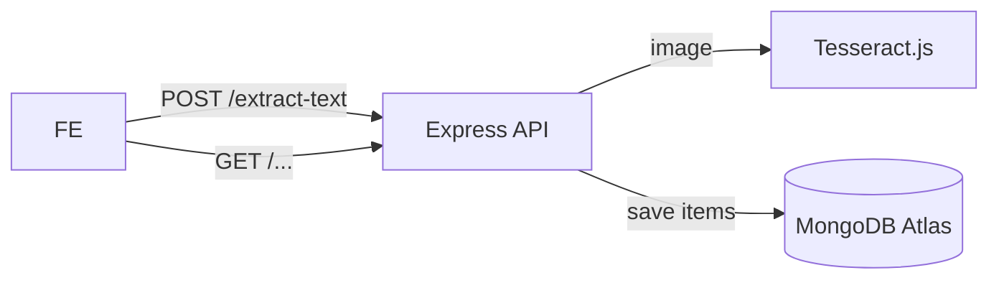

# OCR Item Extraction

Lightweight Node/Express back‑end that turns receipt photos into structured **item + price** rows. It marries **Tesseract.js** OCR with a simple REST API, stores results per‑user in MongoDB via **Mongoose**, and keeps sessions in MongoDB using **express‑session + connect‑mongo**. 

> **Status:** work in progress – front‑end and some polish still on the way.

---

## ✨ Features

* **OCR with Tesseract.js** – runs entirely in Node, supports 100 + languages.
* **File uploads via Multer** – handles `multipart/form‑data` in memory for speed.
* **Express REST API** – minimal, fast HTTP layer.
* **Session‑aware multi‑user flow** – `express‑session` persists sessions in MongoDB.
* **MongoDB + Mongoose** – `User` and `Task` collections with lean schemas.
* **Five ready‑made endpoints** (see *API Reference* below).
* **One‑command dev startup** with `nodemon`.

---

## 🏗️ Architecture at a glance



* **`server.js`** boots Express, CORS, sessions and mounts `routes/ocrRoutes.js`.
* **`routes/ocrRoutes.js`** contains login + CRUD/OCR logic in ~90 LOC.
* **`database/`** defines `user.js`, `task.js`; both simple Mongoose schemas.

---

## 🚀 Quick start

### 1 · Prerequisites

| Tool | Tested version |
|------|----------------|
| Node.js | ≥ 18 |
| npm / yarn | latest |
| MongoDB | local or Atlas cluster |
| `eng.traineddata` | already in repo (English) |

### 2 · Clone + install

```bash
git clone https://github.com/aanh1009/ocr-item-extraction.git
cd ocr-item-extraction
npm install       # pulls express, multer, tesseract.js, etc.
```

### 3 · Environment vars

Copy the example file and fill in your local values:

```bash
cp .env.example .env
```

Required variables:

```env
MONGO_URI=mongodb+srv://<user>:<pass>@cluster0.abcde.mongodb.net/ocr?retryWrites=true&w=majority
SECRET_KEY=super‑secret‑string
```

Keep `.env` local. It is intentionally ignored by Git.

### 4 · Run

```bash
npm run dev       # nodemon auto‑reloads on save
# server on http://localhost:5000
```

---

## 🔌 API Reference

| Method | Endpoint | Body / Params | Purpose |
|--------|----------|---------------|---------|
| `POST` | `/api/login` | `{ "username": "alice" }` | Creates (or fetches) a user, starts session. |
| `POST` | `/api/extract-text` | `multipart/form-data` with **image** field | OCR the image, return lines containing "$". |
| `GET`  | `/api/get-extracted` | – | List items saved under current session. |
| `DELETE` | `/api/delete-item/:id` | – | Delete one item by Mongo `_id`. |
| `DELETE` | `/api/delete-all` | – | Purge all items for current user. |

Returned JSON shapes are defined in the route handlers.

---

## 🗂️ Folder structure

```
.
├─ database/
│  ├─ task.js        # Item schema
│  └─ user.js        # User schema
├─ routes/
│  └─ ocrRoutes.js   # All endpoints
├─ eng.traineddata   # OCR language data
├─ server.js         # App entry point
└─ package.json
```

---

## 🛣️ Roadmap

- [ ] Add proper authentication (JWT or Clerk) instead of throw‑away username.
- [ ] Front‑end React demo (drag‑and‑drop, list view).
- [ ] Better item parsing (regex for currency symbols, totals).
- [ ] Dockerfile + GitHub Actions CI.

---

## 🤝 Contributing

1. Fork → create feature branch (`git checkout -b feature/foo`)
2. Commit with conventional commits.
3. Open PR; ensure linter passes.

---

## 🔒 License

MIT – see `LICENSE` (to be added).

